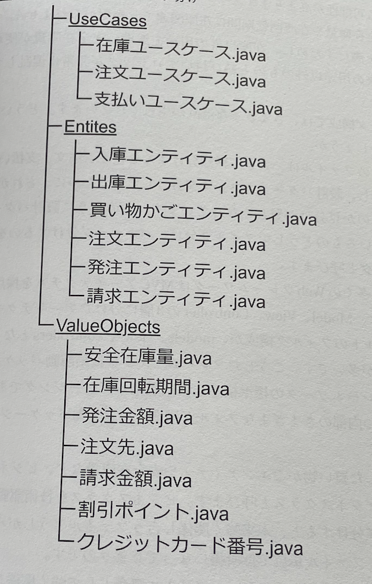

## 9章 設計の健全性をそこなうさまざまな悪魔たち

- 9.1 デッドコード

~~~
if (level > 99){
    level = 99;
}

if (level == 1) {
    initHitPoint();
    initMana();
    initStamina();
}

else if (level == 100){
    addSpecialAbility();
}
~~~

  - 上記のコードにおいて、levelが99より大きい場合、levelを99にする処理は、levelが100の場合には実行されない。このようなコードをデッドコードという。
  - こういったコードがあるとコードが無駄に長くなるだけでなく、何かしら書いてある意味があるのではないか？と読み手を混乱させてしまう。
  - また、何らかの処理によって到達するはずのないデッドコードに到達してしまうと、バグの発生につながることもある
  - デッドコードは削除するよう努めるべき

- 9.2 YAGNI原則
  - You aren't going to need it
  - 今は必要ないという意味
  - 現状必要とされていないものは実装せずにするという原則
  - 今は必要ないが、将来必要になるかもしれないということを考えて実装するのは、デッドコードを生み出す原因になる
  - 必要とされている機能だけを作成し、シンプルにするべきである
  - 可読性・保守性・拡張性を高めるためには、シンプルなコードを書くことが重要である

- 9.3 マジックナンバー

~~~
class ComicManager{
    boolean isOk(){
        return 60 <= value;
    }

    void tryConsume() {
        int tmp = value - 60;
        if (tmp < 0) {
            throw new RuntimeException("残高が足りません");
        }
        value = tmp;
    }
}
~~~

  - 上記のコードにおいて、60という数字が出てくるがどういった用途に使われているかがわからない。このような数字をマジックナンバーという
  - 実装者にしかわからない内容になってしまっている。
  - 今回のケースのように、60という数字が何を表しているのかをわかりやすくするためには、定数を定義してあげると良い

- 9.4 文字列型執着

~~~
String title = "タイトル,255,250,240,64";
~~~

  - 上記のようにカンマ区切りで文字列に複数の情報を含めることを文字列型執着という
  - このようなコードは、文字列をパースする処理が必要になるため、処理が複雑になってしまう
  - しかしながらcsvからデータを取り出す場合などは、文字列型執着を使用するケースがある。

- 9.5 グローバル変数
  - どこからでもアクセス可能な変数をグローバル変数という
  - グローバル変数は、どこからでもアクセス可能なため、どこで変更されたのかがわかりにくくなる

~~~
import threading

count = 0

def increment():
    global count
    for _ in range(1000000):
        count += 1

# 2つのスレッドを生成し、同時にincrement関数を呼び出す
thread1 = threading.Thread(target=increment)
thread2 = threading.Thread(target=increment)

thread1.start()
thread2.start()

thread1.join()
thread2.join()

print("最終的なカウント:", count)
~~~

-  - 実行結果

~~~
最終的なカウント: 2000000
~~~

   - 上記のように、グローバル変数を自身が予期していてない挙動をしたり、バグの原因になることがある
   - また、バグの発生を確認しようとしても、どこが原因か分かりにくいなどといった、デメリットもある
   - だからと言って、必ずしもグローバル変数でのみ起きるとは限らない
   - 巨大なデータクラスを使用すると、さまざまな箇所で呼び出されグローバル変数に似た挙動になることがある。
   - 対策としては、影響範囲を最小化するように設計することである。
     - 無関係なロジックからアクセスできないようにする
     - 呼び出し箇所を減らしすことで、ロジックが理解しやすくなる
     
- 9.6 null問題
  - そもそもnullとは値が存在しないことを表すものである

~~~
class Member {
    private Equipment head;
    private Equipment body;
    private Equipment arm;
    private int defense;

    int getDefense() {
        return defense;
    }

    int totalDefense() {
        return head.getDefense() + body.getDefense() + arm.getDefense();
    }
}
~~~

  - 上記のようなコードがあった場合、実行時にNullPointerExceptionが発生する可能性がある
  - 原因は、headやbody、armのいずれかがnullの場合に発生する
  - 対処法としては、nullチェックを行うことである

~~~
int totalDefense() {
    int defense = 0;
    if (head != null) {
        defense += head.getDefense();
    }
    if (body != null) {
        defense += body.getDefense();
    }
    if (arm != null) {
        defense += arm.getDefense();
    }
    return defense;
}
~~~

  - しかし、上記のようにnullチェックを行うと、コードが複雑になってしまう
  - しかしnullチェックが漏れるとバグに繋がる
- 9.6.1 nullを返さない。渡さない
  - null問題を解消する方法として、
    - nullを返さない
      - nullをreturnしない
    - nullを渡さない
      - nullを引数に渡さない
  - という方法がある

~~~
class Equipment{
    static final Equipment EMPTY = new Equipment("装備なし",0,0,0);
};

final String name;
final int price;
final int defense;
final int magicDefense;

Equipment(final String name, final int price, final int defense, final int magicDefense) {
    if(name.isEmpty()){
        throw new IllegalArgumentException("nameは空文字不可");
    }

    this.name = name;
    this.price = price;
    this.defense = defense;
    this.magicDefense = magicDefense;
}

~~~

~~~
void takeOff(){
    head = Equipment.EMPTY;
    body = Equipment.EMPTY;
    arm = Equipment.EMPTY;
}
~~~

  - nullではなく、空のEquipmentを返すことで、nullチェックを行う必要がなくなる
- 9.6.2 null安全
  - null安全とは、nullを使用しても安全なコードのことである
  - 言語によっては、null安全を保証する機能がある
    - [参考](https://qiita.com/koher/items/e4835bd429b88809ab33)
  - null安全の機能
    - null非許容
      - nullを保持できない方
        - kotlinの場合は、?をつけることでnullを許容することができるが、デフォルトでは非許容である

- 9.7 例外の握り潰し

~~~
try {
    reservations.add(product);
} catch (Exception e) {
}
~~~

  - 上記のコードにおいて、例外をキャッチしても何もしない
    - これは例外の握り潰しと呼ばれる
  - 例外の握り潰しは、バグの原因になる
    - そもそも例外が握りつぶされているため、エラーが生じていても問題ないように見える
    - 実際は例外が起きているため、本来の挙動にならない
    - バグがどこで生じているかわからないので、ひたすらに原因を探すことになり、時間がかかる
  - 例外の処理としては、通知や記録、リカバリする必要がある

~~~
try {
    reservations.add(product);
} catch (Exception e) {
    requestNotifyException("予約できない商品です");
}
~~~

- 9.8 設計秩序を破壊するメタプログラミング
  - プログラム実行時にプログラム構造自体を制御するプログラムのことをメタプログラミングと呼ぶ
  - 裏技だったり、黒魔術
  - メタプログラミングを使用すると、設計秩序を破壊することになる

~~~
class Level{
    private static final int MIN = 1;
    private static final int MAX = 99;
    final int value;

    private Level(final int value){
        if(value < MIN || MAX < value){
            throw new IllegalArgumentException("レベルは" + MIN + "から" + MAX + "までです。");
        }
        this.value = value;
    }
    static Level initialize(){
        return new Level(MIN);
    }
    Level nextLevel(){
        if (value == MAX){
            return this;
        }
        return new Level(value + 1);
    }
}
~~~

  - 上記のコード自体は問題ない
  - しかし下記コードを実行すると、予期せぬ動作を起こす

~~~
Level level = Level.initialize();
System.out.println(level.value);

Field field = level.getClass().getDeclaredField("value");
field.setAccessible(true);
field.set(level, 999);

System.out.println(level.value);
~~~

  - このコードをメタプログラミングと呼ぶ
  - 本来インスタンス生成時にはnewを使用するが、リフレクションを使用すると、newを使用せずにインスタンスを生成することができる

~~~
pacaage customer;

class User{}
~~~

- 9.9 技術駆動パッケージング
  - パッケージの区切り方、フィルタの分け方に注意しないと悪魔を呼ぶ原因に、、、

①
  

②
  

  - ①のように、パッケージを設計パターンで分けると、どこに依存関係があるのか分かりにくくなってしまう
  - このように設計パターンや似た構造でパッケージを分けることを技術駆動パッケージングと呼ぶ
  - ②のように、同じ分類同士でまとめているので、仕様変更する際に、その用途にあったところだけ見れば良い

- 9.10 サンプルコードのコピぺ
  - サンプルコードをコピペして使用すると、そのまま使用することができるが、そのまま使用すると、設計が悪いコードをそのまま使用することになる
  - あくまでサンプルコードは、参考程度に使用すること

- 9.11 銀の弾丸
  - 万能なコードなんてものは存在しない
  - 無理に使おうとすると、拡張性が低くなり、メンテナンス性が低くなる
  - コードに限らなず、どの手法が課題解決に最も効果的かを考えることが大切
  - 設計にBestはない、常にBetterを目指すことが大切